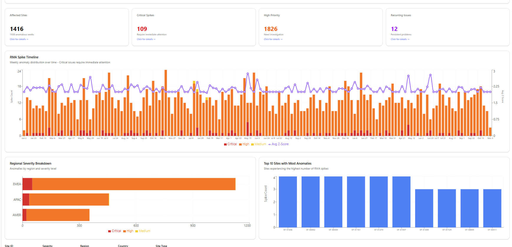
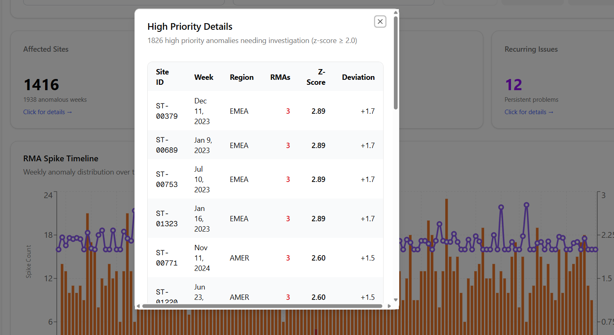
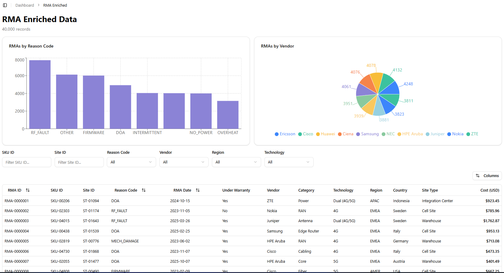
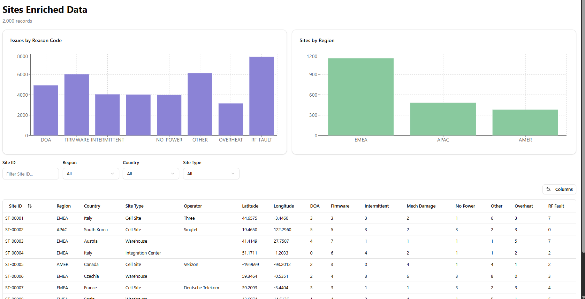
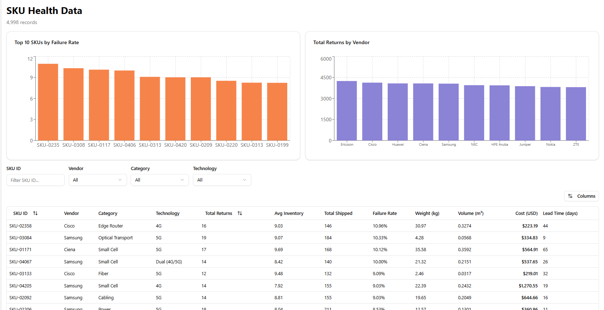

| Task                                                                  | Notebook                                                              | Status                                                                                                                                                                                                                                                                                                                                                                                                       |
| --------------------------------------------------------------------- | --------------------------------------------------------------------- | ------------------------------------------------------------------------------------------------------------------------------------------------------------------------------------------------------------------------------------------------------------------------------------------------------------------------------------------------------------------------------------------------------------ |
| Given a new purchase order, what is the predicted actual lead time?   | [delayed_shippment](research/delayed_shippment.ipynb)                 | There are too many problems with the data to get anything near a good result. I removed model code completely since correlation between features and target is almost non-existent. On top of that, >98% of rows are somehow corrupted (`ship_date < po_date`), and status flag completely does not match with dates, etc.                                                                                   |
| What is the probability this shipment will be delayed?                | [delayed_shippment](research/delayed_shippment.ipynb) | Same as above                                                                                                                                                                                                                                                                                                                                                                                                |
| Forecast site-level inventory for each SKU for the next 30/60/90 days | [forecast_second_try](research/forecast_second_try.ipynb)             | Actual delivery date was missing for most data. I could assume something – I know, but I decided to just focus on other tasks                                                                                                                                                                                                                                                                                |
| Predict the probability that a SKU will be returned under warranty.   | -                                                                     | Features did not correlate with target at all.                                                                                                                                                                                                                                                                                                                                         |
| Detect abnormal shipment transit times (e.g., lost shipments).        | [abnormal_shippement_times](research/abnormal_shippement_times.ipynb) | I did it but with some assumptions:   1. I assumed that `transit_events` has complete data to the max(`event_ts`)   2. I came up with times to consider a shipment lost (2 ways – static threshold and dynamic threshold based on historical data). Although historical data did not make any sense.   3. Correlation between `is_shipment_lost` and other features was statistically insignificant |
| Detect sites with abnormal failure rates (RMA spike detection).       | [rma_analysis](research/rma_analysis.ipynb)                           | Data looks random but the task is done. It was the most interesting one, so I decided to create a UI for it as well (screenshots below)                                                                                                                                                                                                                                                                      |
| Which Incoterm tends to minimize total cost for each region?          | [Incoterm](research/Incoterm.ipynb)                                   | Some assumptions as well, like:   - Insurance cost = 1% of unit price   - Duty cost = 5% of unit price   - Handling (flat) = $50   - Freight rate per kg: Road = 0.8 USD/kg, Sea = 0.15 USD/kg, Air = 1.5 USD/kg.   However, results tell us that best Incoterm is DDP for all regions, which is not realistic again                                                                          |

## Simple UI for RMA spike detection

Anomallies view (Main)

RMA analysis view

Site analysis view

Sku analysis view

The ui is fully functional, and interactive. (with filtering, sorting, searching, etc.)

To sum up, I am pretty sure that data is random. 
